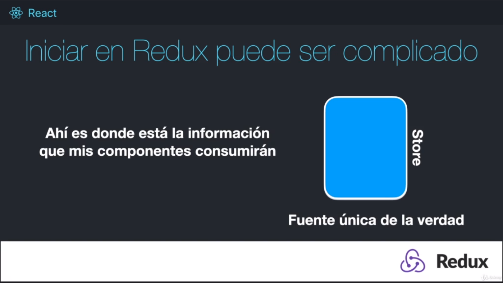
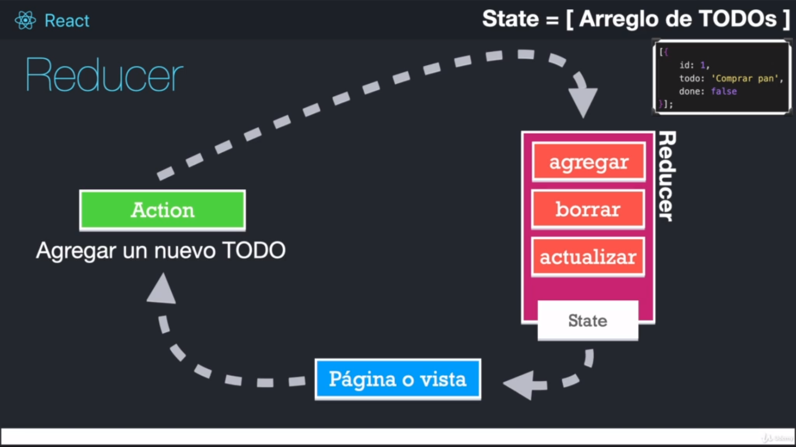
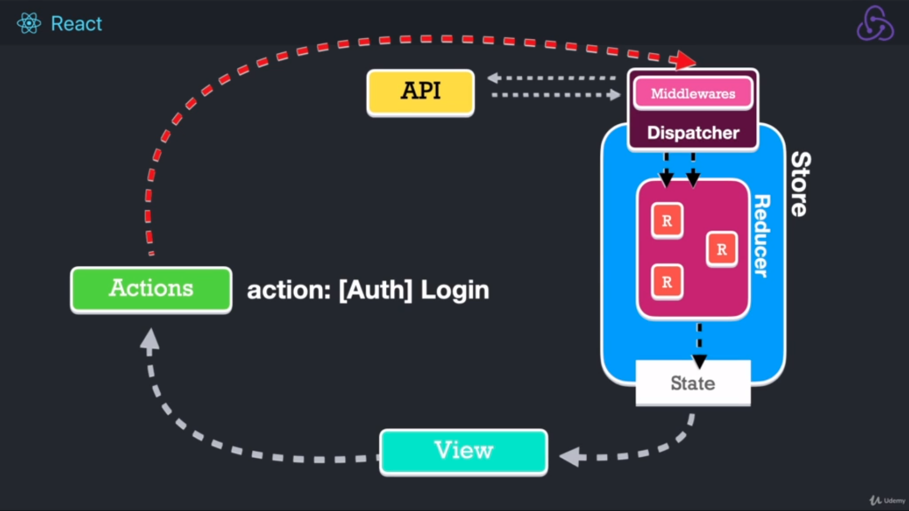

# Journal App

## SASS

```
npm install node-sass

```

Otros:

```
npm install react-router-dom
```

https://cdnjs.com/libraries/font-awesome

## REDUX

Que es redux?
Es un contenedor predecible del estado de nuestra aplicacion.



Con tareas sincronas:



Con tareas asincronas, pasa por un middleware:



Sitio oficial de redux:

https://es.redux.js.org/

https://react-redux.js.org/

```
npm install react-redux redux
```

Para usar el "Redux devtools extension" se debe aumentar una linea a; createStore:

https://github.com/zalmoxisus/redux-devtools-extension#usage

https://www.npmjs.com/package/redux-thunk

```
npm install --save redux-thunk
```

Para validaciones: https://www.npmjs.com/package/validator

```
npm i validator
```

https://sweetalert2.github.io/

```
npm install sweetalert2
```
